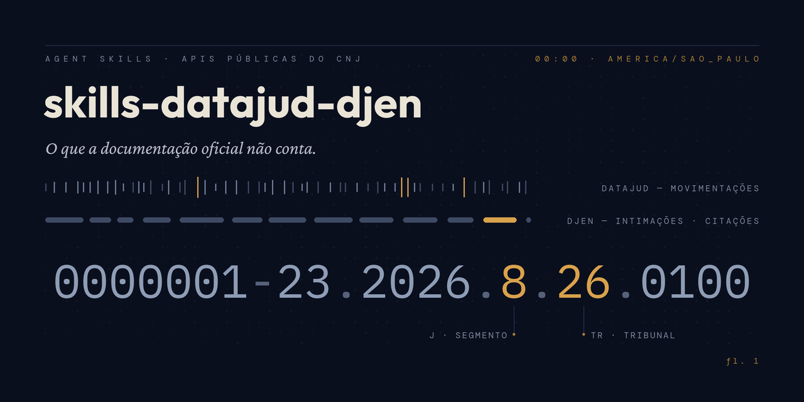

# skills-datajud-djen

**Agent Skills com conhecimento de produção sobre as APIs públicas do CNJ:
DataJud e DJEN (Comunica PJe).**

As documentações oficiais dizem *o que* as APIs fazem. Estas skills
registram o que só se aprende operando-as em produção: os timeouts que
funcionam de verdade, o geo-bloqueio que só aparece no deploy, o parâmetro
que falha em silêncio, a resposta 200 que mente. Todo o conteúdo vem da
operação real do [Judis](https://judis.com.br), um SaaS jurídico que consome
as duas APIs diariamente.

São skills no formato [Agent Skills](https://agentskills.io) (`SKILL.md` +
referências), prontas para usar com Claude Code e qualquer agente compatível
— e os arquivos são markdown puro, legíveis por humanos sem nenhuma
ferramenta.

## As skills

### [`skills/datajud`](skills/datajud/SKILL.md)

API Pública do DataJud (`api-publica.datajud.cnj.jus.br`) — consulta de
metadados e movimentações processuais via Elasticsearch.

Destaques do que está documentado:

- **Consulta pelo alias do tribunal, derivado do número CNJ** (com função
  pronta) — o curinga `api_publica_*` retorna 504 na prática;
- **Respostas 200 parciais** (`_shards.failed > 0`) que transformam "não
  encontrado" em mentira;
- **Timeouts realistas** (a API responde em 10-40s; medimos tudo),
  política de retry para 429 e por que 504 nunca deve ser retryado;
- **Datas de 14 dígitos em horário de Brasília** sem indicação de fuso — e
  os três formatos de data que coexistem;
- **Códigos TPU** de movimentos → inferência de fase processual;
- Circuit breaker, rate limiting, desenho de sync periódico, chave pública
  rotacionada pelo CNJ.

### [`skills/djen`](skills/djen/SKILL.md)

API do DJEN / Comunica PJe (`comunicaapi.pje.jus.br`) — intimações, citações
e publicações de todos os tribunais, sem autenticação.

Destaques do que está documentado:

- **Geo-bloqueio: 403 para IPs fora do Brasil** — funciona no notebook,
  falha na cloud function em `us-central1`;
- **`itensPorPagina` máximo de 50**, com falha silenciosa acima disso;
- **Variantes de sufixo da OAB por tribunal** (`123456`, `123456-O`,
  `123456-A`…) — sem elas, ~90% das publicações ficam invisíveis;
- **Páginas vazias transientes** no meio da paginação e `count` capado em
  ~10.000;
- **Sanitização do HTML** das publicações — incluindo por que `class` é
  vetor de ataque (UI redressing com Tailwind);
- Rate limit não documentado, cancelamento de publicações, dedupe,
  certidões em PDF, desenho de monitoramento diário por OAB.

## Instalação

**Claude Code** — copie as skills para o diretório de skills do projeto
(ou o pessoal, para valer em todos os projetos):

```bash
git clone https://github.com/rvsanches/skills-datajud-djen.git
# por projeto:
cp -r skills-datajud-djen/skills/datajud skills-datajud-djen/skills/djen .claude/skills/
# ou pessoal (todos os projetos):
cp -r skills-datajud-djen/skills/datajud skills-datajud-djen/skills/djen ~/.claude/skills/
```

A partir daí, ao trabalhar com essas APIs o Claude carrega o conhecimento
automaticamente (as skills disparam por contexto: "consultar processo no
DataJud", "erro 403 no comunicaapi", "monitorar publicações por OAB"...).

**Sem Claude / outros agentes** — os arquivos são markdown comum. Leia
direto (comece por [`docs/datajud.md`](docs/datajud.md) e
[`docs/djen.md`](docs/djen.md)) ou aponte seu agente para os `SKILL.md`.

## Estrutura

```
skills/
  datajud/
    SKILL.md                 # visão geral + 7 regras de ouro
    references/
      consultas.md           # auth, alias por número CNJ, queries
      resposta.md            # parsing defensivo, datas, códigos TPU
      producao.md            # timeouts, retry, breaker, sync, alertas
  djen/
    SKILL.md                 # visão geral + 7 regras de ouro
    references/
      consultas.md           # filtros, paginação, variantes de OAB, certidão
      resposta.md            # campos, dedupe, cancelamento, matching
      producao.md            # geo-bloqueio, tetos, HTML hostil, digest
docs/
  datajud.md                 # guia de campo (leitura humana)
  djen.md                    # guia de campo (leitura humana)
```

## Contribuindo

Achou um comportamento novo dessas APIs? Um limite diferente, um campo novo,
um erro que não está aqui? Abra uma issue ou PR contando:

1. **O que observou** (request, resposta, códigos de erro);
2. **Como reproduzir** (endpoint, parâmetros — anonimize OABs, nomes e
   números de processo reais);
3. **Quando** (as APIs mudam sem aviso; a data da observação importa).

Correções de informações que ficaram desatualizadas são as contribuições
mais valiosas.

## Avisos

- Projeto **independente, sem afiliação com o CNJ**. As APIs são públicas e
  operadas pelo CNJ, sem SLA nem versionamento formal — tudo aqui pode
  mudar sem aviso. Informações datadas de 2025-2026.
- Os dados servidos pelas APIs são públicos, mas ferramentas construídas
  sobre eles **não substituem a consulta oficial** aos diários e sistemas
  dos tribunais.
- Exemplos anonimizados: números de processo, OABs e nomes são fictícios.

## Licença

[MIT](LICENSE)
